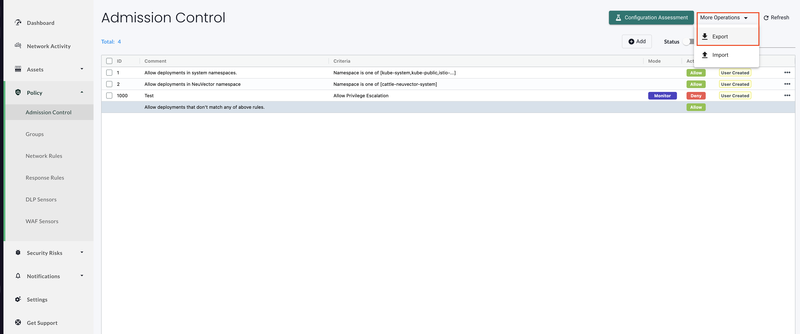

# nvrules2kw

**nvrules2kw** is a CLI tool that converts [NeuVector](https://open-docs.neuvector.com/policy/admission) Admission Control Rules into [Kubewarden](https://www.kubewarden.io/) [Policy Custom Resources](https://docs.kubewarden.io/reference/CRDs).

This tool simplifies the migration from NeuVector's admission control model to [Kubewarden](https://kubewarden.io/) — a universal policy engine for Kubernetes that streamlines the adoption of policy-as-code practices.

## Features

- Parse NeuVector admission control rules (exported via `/v1/admission/rules` API)
- Generate equivalent Kubewarden `ClusterAdmissionPolicy` or `ClusterAdmissionPolicyGroup` resources
- Supports output to stdout or to a file
- Bind the generated policy to a specified Policy Server
- Optionally enable audit/background enforcement
- Display a summary table showing the status of each rule conversion


## Quick Start

This guide provides step-by-step instructions to set up and execute **`nvrules2kw`**, help you convert NeuVector Admission Control Rules into Kubewarden Policies within your environment.

---

### 🛠️ Installation

You can either:

* Download the latest release binary from the [Releases](https://github.com/neuvector/neuvector-kubewarden-policy-converter/releases) page, or
* Build from source:

```bash
go build -o nvrules2kw
```

---

### 📥 Fetch NeuVector Admission Control Rules

You can obtain the rules in two ways:

#### Option 1: Using the REST API

```bash
curl -k \
  -H "Content-Type: application/json" \
  -H "X-Auth-Apikey: <API_KEY>" \
  "https://<API_SERVER_ADDRESS>/v1/admission/rules" \
  -o rules.json
```

#### Option 2: From the NeuVector Console

Navigate to the Admission Control Rules page in the NeuVector console and click **Export**, then save the file locally.

For reference, see the example below:


Here you will get as either `rules.json`(from option 1) or `rules.json`(from option 2). Both formats are supported.

---
### 🔄 Convert to Kubewarden Policy CR

You can now convert your rule file using:

```bash
nvrules2kw convert --rulefile rules.json --output policies.yaml
```

---

### 📊 Summary Table: Column Descriptions

This table appears after running the `convert` command and shows the status of each rule processed.

```
+------+--------+---------------------------------+
|  ID  | STATUS |              NOTES              |
+------+--------+---------------------------------+
|    1 | Skip   | NeuVector environment only rule |
|    2 | Skip   | NeuVector environment only rule |
| 1000 | Ok     | Rule converted successfully     |
+------+--------+---------------------------------+
```

| Column     | Description                                                                                                                                                            |
| ---------- | ---------------------------------------------------------------------------------------------------------------------------------------------------------------------- |
| **ID**     | The unique identifier of the original NeuVector rule.                                                                                                                  |
| **STATUS** | The result of the rule conversion:<br>• `Ok` – The rule was successfully converted.<br>• `Skip` – The rule was ignored (e.g., applies only in NeuVector environments). |
| **NOTES**  | Additional context about the conversion result, such as why a rule was skipped or confirmation of success.                                                             |

✅ *Congratulations! You've successfully converted your first NeuVector rule.*

---

### 🔍 CLI Usage Overview

```
NAME:
   nvrules2kw - Convert NeuVector Admission Control Rules to Kubewarden Policies

USAGE:
   nvrules2kw [global options] command [command options] [arguments...]

COMMANDS:
   convert   Convert NeuVector rules to Kubewarden policies
   support   Show supported criteria matrix
   help, h   Show help for a command

GLOBAL OPTIONS:
   --help, -h   Show help
```

---

## Support matrix

You can use the `support` command to view the support matrix.

```
nvrules2kw support
```

The following table shows the support matrix:

```
+--------------------------------------+-----------+------+
|            CRITERION NAME            | SUPPORTED | NOTE |
+--------------------------------------+-----------+------+
| Allow Privilege Escalation           | Yes       |      |
| Annotations                          | Yes       |      |
| Add customized criterion             | No        |      |
| Count of high severity CVE           | No        |      |
| Count of high severity CVE with fix  | No        |      |
| Count of medium severity CVE         | No        |      |
| CVE names                            | No        |      |
| CVE score                            | No        |      |
| Environment variables with secrets   | Yes       |      |
| Environment variables                | Yes       |      |
| Image                                | Yes       |      |
| Image compliance violations          | No        |      |
| Image without OS information         | No        |      |
| Image registry                       | Yes       |      |
| Image scanned                        | No        |      |
| Image signed                         | No        |      |
| Image Sigstore Verifiers             | No        |      |
| Labels                               | Yes       |      |
| Modules                              | No        |      |
| Mount Volumes                        | No        |      |
| Namespace                            | Yes       |      |
| PSP Best Practice                    | Yes       |      |
| Resource Limit Configuration (RLC)   | No        |      |
| Run as privileged                    | Yes       |      |
| Run as root                          | Yes       |      |
| Service Account Bound High Risk Role | No        |      |
| Share host's IPC namespaces          | Yes       |      |
| Share host's Network                 | Yes       |      |
| Share host's PID namespaces          | Yes       |      |
| StorageClass Name                    | No        |      |
| User                                 | Yes       |      |
| User groups                          | Yes       |      |
| Violates PSA policy                  | No        |      |
+--------------------------------------+-----------+------+

```

