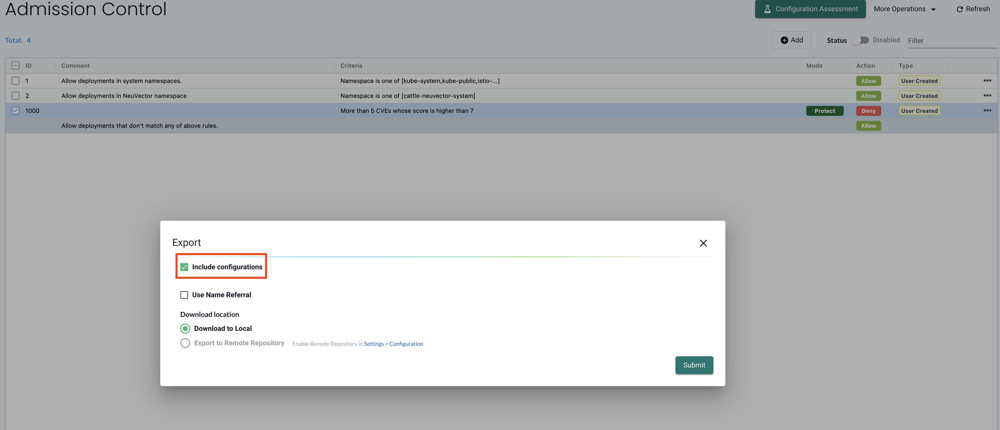
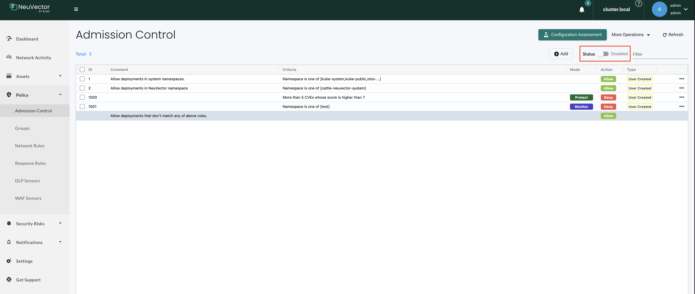

# nvrules2kw

**nvrules2kw** is a CLI tool that converts [NeuVector](https://open-docs.neuvector.com/policy/admission) Admission Control Rules into [Kubewarden](https://www.kubewarden.io/) [Policy Custom Resources](https://docs.kubewarden.io/reference/CRDs).

This tool simplifies the migration from NeuVector's admission control model to [Kubewarden](https://kubewarden.io/) — a universal policy engine for Kubernetes that streamlines the adoption of policy-as-code practices.

## Features

- Parse NeuVector admission control rules (exported via `/v1/admission/rules` API)
- Generate equivalent Kubewarden `ClusterAdmissionPolicy` or `ClusterAdmissionPolicyGroup` resources
- Supports output to stdout or to a file
- Bind the generated policy to a specified Policy Server
- Optionally enable audit/background enforcement
- Display a summary table showing the status of each rule conversion

## Quick Start

This guide provides step-by-step instructions to set up and execute **`nvrules2kw`**, help you convert NeuVector Admission Control Rules into Kubewarden Policies within your environment.

---

### 🛠️ Installation

You can either:

* Download the latest release binary from the [Releases](https://github.com/neuvector/neuvector-kubewarden-policy-converter/releases) page, or
* Build from source:
```bash
make build
```
---

### 📥 Fetch NeuVector Admission Control Rules

You will get `rules.json` (Option 1) or `rules.yaml` (Option 2).

### Option 1: REST API

```bash
curl -k \
  -H "Content-Type: application/json" \
  -H "X-Auth-Apikey: <API_KEY>" \
  "https://<API_SERVER_ADDRESS>/v1/admission/rules" \
  -o rules.json
```

### Option 2: Console UI

1. Navigate to **Policy → Admission Control Rules** in the NeuVector console.
2. Click **Export** and save the file.
3. **⚠️ Important**: When exporting rules from NeuVector, you **must** check **"Include configurations"**, otherwise the converter cannot process them correctly.

### Export Process:

1. **Click Export in the Admission Control Rules panel:**
   

2. **In the export dialog, check "Include configurations":**
   

> ⚠️ **Warning (NeuVector ≤ 5.4.6)**
> See [FAQ: Rule IDs and Exports](docs/FAQ.md#rule-ids-and-exports) for details.
> In versions prior to 5.4.7, exported rules do **not** include IDs.
> To preserve IDs, re-export from a cluster running **5.4.7+**.

---
### 🔄 Convert to Kubewarden Policy CR

#### Updated CLI Usage

The CLI has been updated. The new usage is:

```bash
nvrules2kw convert <yaml_file>
```

**Examples:**
```bash
# Convert rules from a YAML file (output defaults to policies.yaml)
nvrules2kw convert rules.yaml

# Convert rules from a JSON file
nvrules2kw convert rules.json

# Specify custom output file
nvrules2kw convert rules.yaml --output my-policies.yaml

# Override all rules to monitor mode (useful for testing)
nvrules2kw convert rules.yaml --mode monitor
```

By default, the output will be written to `policies.yaml`.

---

### ⚙️ Mode Resolution

The effective enforcement mode for each converted policy is determined by the following priority:

**Priority: CLI `--mode` > File-defined mode > Default mode (`protect`)**

#### Examples

| Case | Format | CLI Mode  | File Mode | Effective Mode           |
|:----:|:------:|-----------|-----------|--------------------------|
| A    | yaml   | monitor   | protect   | **monitor** (CLI overrides) |
| B    | yaml   | ""        | monitor   | **monitor**              |
| C    | yaml   | ""        | protect   | **protect**              |
| D    | json   | monitor   | ""        | **monitor** (CLI overrides) |
| E    | json   | protect   | ""        | **protect** (CLI overrides) |
| F    | json   | ""        | ""        | **protect** (default)    |

---

### 📊 Summary Table: Column Descriptions

This table appears after running the `convert` command with the `--show-summary` flag and shows the status of each rule processed.

Example with summary table:

```bash
nvrules2kw convert rules.yaml --show-summary
```

```
+------+--------+---------------------------------+
|  ID  | STATUS |              NOTES              |
+------+--------+---------------------------------+
|    1 | Skip   | NeuVector environment only rule |
|    2 | Skip   | NeuVector environment only rule |
| 1000 | Ok     | Rule converted successfully     |
+------+--------+---------------------------------+
```

| Column     | Description                                                                                                                                                            |
| ---------- | ---------------------------------------------------------------------------------------------------------------------------------------------------------------------- |
| **ID**     | The unique identifier of the original NeuVector rule.                                                                                                                  |
| **STATUS** | The result of the rule conversion:<br>• `Ok` – The rule was successfully converted.<br>• `Skip` – The rule was ignored (e.g., applies only in NeuVector environments). |
| **NOTES**  | Additional context about the conversion result, such as why a rule was skipped or confirmation of success.                                                             |

✅ *Congratulations! You've successfully converted your first NeuVector rule.*

---

### 🔍 CLI Usage Overview

```
NAME:
   nvrules2kw - Convert NeuVector Admission Control Rules to Kubewarden Policies

USAGE:
   nvrules2kw [global options] command [command options] [arguments...]

COMMANDS:
   convert   Convert NeuVector rules to Kubewarden policies
   support   Show supported criteria matrix
   help, h   Show help for a command

GLOBAL OPTIONS:
   --help, -h   Show help
```

---

## Support matrix

You can use the `nvrules2kw support` command to view the support matrix. See [support matrix doc](docs/SUPPORT_MATRIX.md) for more details.

---
## Note
- **Avoid double enforcement.** After converting NeuVector admission control rules to Kubewarden policies, disable the matching NeuVector rules.


