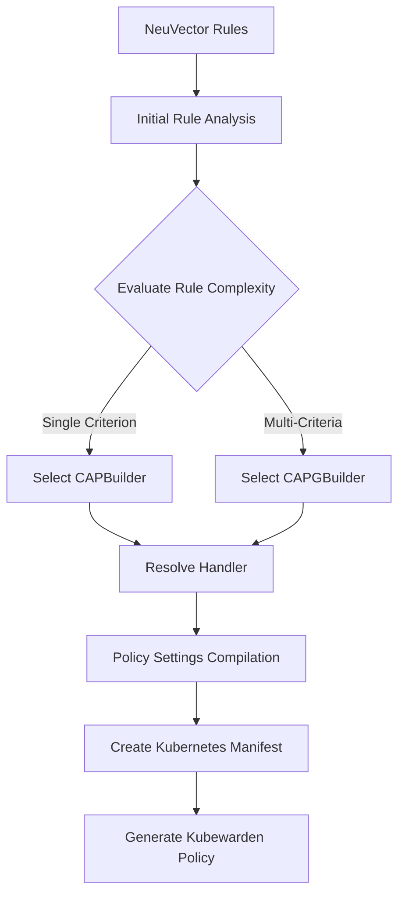

# NeuVector-Kubewarden Policy Converter Architecture

## 📋 Overview

This document describes the core architecture of the NeuVector-Kubewarden Policy Converter, which transforms NeuVector admission control rules into Kubewarden policies for Kubernetes clusters.

## 🏗️ Core Components

### Policy Builders

The system uses a factory pattern to create appropriate Kubewarden policies based on rule complexity:

#### `CAPBuilder` (Single Policy Builder)
- **Purpose**: Creates single `ClusterAdmissionPolicy` for single criterion rules
- **Use Case**: Rules with single criterion
- **Example**: Rule contains one criterion for namespace restrictions on resources.
- **Output**: Individual Kubewarden policy

#### `CAPGBuilder` (Group Policy Builder)
- **Purpose**: Creates `ClusterAdmissionPolicyGroup` for complex multi-criteria rules
- **Use Case**: Rules requiring multi-criteria that must be evaluated together
- **Example**: Complex rule contains multiple criteria, annotations and labels limits for resources.
- **Output**: Grouped Kubewarden policy with shared settings

#### `Factory`
- **Purpose**: Factory that intelligently selects the appropriate builder type
- **Decision Logic**: Analyzes rule complexity and criteria count to select CAPBuilder vs CAPGBuilder
- **Benefits**:
  - Abstracts builder selection from consumers
  - Ensures optimal policy structure for each rule type
  - Maintains consistency across policy generation

### Handler System

- **Modular design** for generating policy settings, offering a BasePolicyHandler that can be customized based on specific policy requirements.
- Each handler represents a Kubewarden policy and is responsible for generating the policy settings for both individual policies and policy groups.

#### Base Handler Interface
```go
type BasePolicyHandler struct {
    Unsupported  bool                // Whether this handler supports the policy type
    SupportedOps map[string]bool     // Supported NeuVector operations
    Name         string              // Handler identifier
    Module       string              // Kubewarden module URI
}
```


**Extensibility:**

You can customize the policy setting in BuildPolicySettings, BuildPolicyGroupSettings
```go
// Adding a new handler is straightforward:
type NewPolicyHandler struct {
    BasePolicyHandler
}

func (h *NewPolicyHandler) BuildPolicySettings(criterion *nvapis.RESTAdmRuleCriterion) ([]byte, error) {
    // Implementation specific to new policy type
}

func (h *NewPolicyHandler) BuildPolicyGroupSettings(criteria []*nvapis.RESTAdmRuleCriterion) ([]byte, error) {
    // Implementation specific to new policy type
}
```

### Policy Generation Flow



## 🚀 Extensibility

### Adding New Policy Types

1. **Create Handler**: Implement the handler interface for your policy type
2. **Register Handler**: Add the handler to `converter.go`
3. **Define Module**: Specify the Kubewarden module URI
4. **Implement Logic**: Convert criteria to appropriate validation rules
