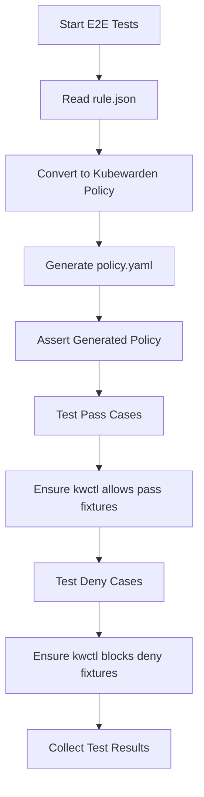

# Test Architecture

## 📋 Overview

This document describes the testing architecture for the NeuVector-Kubewarden Policy Converter, including test structure, data formats, and guidelines for adding new test cases.

### Current Achievement
- 🚀 CI Integration
- Execute end-to-end (E2E) tests both locally and within the CI environment

## 🏗️ Test Structure
### Directory Layout
```
test/
├── e2e/                   # End-to-End test suite
│   └── e2e_test.go        # Entry point for conversion testing under rules/
├── fixtures/              # Kubernetes manifests grouped by resource (test cases)
│   ├── cronjobs/
│   ├── deployments/
│   └── pods/
└── rules/                                            # Policy configurations & test data
    ├── multi_criteria/                               # Complex multi-condition rules
    │   ├── namespace_foo_annotation_contain_all/     # Multi-criteria test cases
    │   │   ├── rule.json         # NeuVector rules example
    |   |   ├── policy.yaml       # Converted policy YAML result
    │   │   └── configs.json      # Test configurations
    │   └── resource_limits/
    └── single_criterion/         # Simple single-condition rules
        ├── annotations/          # NeuVector rules
        │   ├── contains_all      # Supported NeuVector rule operations
                ├── rule.json
        |       ├── policy.yaml
        │       └── configs.json
        └── annotations/
```

### Test Categories

#### Single Criterion Tests
- **Purpose**: Test simple, single-condition rules
- **Examples**: Namespace restrictions, single image validations
- **Location**: `test/rules/single_criterion/`

#### Multi-Criteria Tests
- **Purpose**: Test complex rules with multiple conditions
- **Examples**: Combined namespace + image + resource policies
- **Location**: `test/rules/multi_criteria/`

## 📄 Test Data Formats

### `rule.json` Structure

Contains NeuVector admission rules in their native format:

```json
{
    "rules": [
        {
            "category": "Kubernetes",
            "cfg_type": "user_created",
            "comment": "",
            "containers": [
                "containers"
            ],
            "criteria": [
                {
                    "name": "allowPrivEscalation",
                    "op": "=",
                    "path": "allowPrivEscalation",
                    "value": "true"
                }
            ],
            "critical": false,
            "disable": false,
            "id": 1000,
            "rule_mode": "",
            "rule_type": "deny"
        }
    ]
}
```

#### Field Descriptions:

##### Core Identification Fields
- **`id`**: Unique integer identifier for the rule
  - Range: > 1000 for user-created rules (NeuVector design convention)
  - Used to generate unique policy names and avoid conflicts
  - Example: `1001`, `1002`, etc.

##### Rule Behavior Configuration
- **`rule_type`**: Base action for policy enforcement
  - `"deny"`: Block resources that match the criteria
  - `"allow"`: Permit resources that match the criteria (not supported)

- **`rule_mode`**: Enforcement level and behavior
  - `"protect"`: Actively block non-compliant resources
  - `"monitor"`: Log violations but allow resources through
  - `""` (empty): Use default behavior based on rule_type

- **`comment`**: Human-readable rule description
  - Used for generating policy names and documentation
  - Should describe the rule's purpose and scope
  - Example: `"Deny privileged containers in production namespaces"`

- **`disable`**: Administrative control for rule activation
  - `true`: Rule is disabled (not converted)
  - `false`: Rule is active and will be converted
  - Allows temporary deactivation without deletion

### `configs.json` Structure

Defines test scenarios with expected outcomes:

```json
{
  "description": "Test single criteria rule (does not allow run as root)",
  "runKwctl": true,
  "testWorkspace": "../fixtures/",
  "pass": [
    "deployments/normal.yaml",
    "cronjobs/normal.yaml",
    "pods/normal.yaml"
  ],
  "deny": [
    "cronjobs/run_as_root.yaml",
    "deployments/run_as_root.yaml",
    "pods/run_as_root.yaml"
  ]
}
```

#### Field Descriptions:

##### Test Configuration
- **`runKwctl`**: Whether to run kwctl validation during testing
  - `true`: Execute kwctl policy validation (requires kwctl binary)
  - `false`: Skip kwctl validation (faster testing)
  - Used for integration testing with actual Kubewarden runtime

- **`testWorkspace`**: Base directory path for test fixtures
  - Usually `"../fixtures/"` for standard test layout
  - Relative path from test directory to fixture files

##### Test Cases
- **`pass`**: Array of test fixtures that should be **ALLOWED** by the policy
  - Resources that comply with the rule and should pass validation
  - Example: `["deployments/normal.yaml", "pods/normal.yaml"]`

- **`deny`**: Array of test fixtures that should be **REJECTED** by the policy
  - Resources that violate the rule and should be rejected
  - Example: `["pods/run_as_root.yaml", "deployments/privileged.yaml"]`

## 🔄 E2E Test Flow

### Test Execution Pipeline



## 📝 Adding New Test Data

### For Single Criterion Rules

#### Step 1: Create Test Directory
```bash
mkdir -p test/rules/single_criterion/your_policy_type
cd test/rules/single_criterion/your_policy_type
```

#### Step 2: Add Rule Definition (`rule.json`)
```json
{
  "rules": [
      {
          "category": "Kubernetes",
          "cfg_type": "user_created",
          "comment": "",
          "containers": [
              "containers"
          ],
          "criteria": [
              {
                  "name": "allowPrivEscalation",
                  "op": "=",
                  "path": "allowPrivEscalation",
                  "value": "true"
              }
          ],
          "critical": false,
          "disable": false,
          "id": 1000,
          "rule_mode": "",
          "rule_type": "deny"
      }
  ]
}
```

#### Step 3: Add Test Configuration (`configs.json`)
```json
{
  "description": "Test single criteria rule (does not allow run as root)",
  "runKwctl": true,
  "testWorkspace": "../fixtures/",
  "pass": [
    "deployments/normal.yaml",
    "cronjobs/normal.yaml",
    "pods/normal.yaml"
  ],
  "deny": [
    "cronjobs/run_as_root.yaml",
    "deployments/run_as_root.yaml",
    "pods/run_as_root.yaml"
  ]
}
```

#### Step 4: Create Test Policy (`policy.yaml`)
```yaml
apiVersion: policies.kubewarden.io/v1
kind: ClusterAdmissionPolicy
metadata:
  creationTimestamp: null
  name: neuvector-rule-1000-conversion
spec:
  backgroundAudit: true
  mode: protect
  module: registry://ghcr.io/kubewarden/policies/container-running-as-user:v1.0.4
  mutating: false
  policyServer: default
  rules:
  - apiGroups:
    - ""
    apiVersions:
    - v1
    operations:
    - CREATE
    - UPDATE
    resources:
    - pods
  - apiGroups:
    - apps
    apiVersions:
    - v1
    operations:
    - CREATE
    - UPDATE
    resources:
    - deployments
    - replicasets
    - daemonsets
    - statefulsets
  - apiGroups:
    - batch
    apiVersions:
    - v1
    operations:
    - CREATE
    - UPDATE
    resources:
    - jobs
    - cronjobs
  settings: {}
status:
  policyStatus: ""
```

#### Step 5: Create Test Fixtures
```bash
# Create corresponding YAML manifests
touch test/fixtures/pods/allowed_resource.yaml
touch test/fixtures/pods/blocked_resource.yaml
```

Example fixture (`allowed_resource.yaml`):
```yaml
apiVersion: v1
kind: Pod
metadata:
  name: test-allowed-pod
  namespace: default
spec:
  containers:
  - name: test-container
    image: nginx:latest
    # Configure according to your test scenario
```

### For Multi-Criteria Rules

#### Step 1: Create Test Directory
```bash
mkdir -p test/rules/multi_criteria/your_policy_combination
cd test/rules/multi_criteria/your_policy_combination
```

#### Step 2: Add Rule Definition (`rule.json`)
```json
{
    "rules": [
        {
            "category": "Kubernetes",
            "cfg_type": "user_created",
            "comment": "Deny both IPC and network sharing with host",
            "containers": [
                "containers"
            ],
            "criteria": [
                {
                    "name": "runAsRoot",
                    "op": "=",
                    "path": "runAsRoot",
                    "value": "true"
                },
                {
                    "name": "runAsPrivileged",
                    "op": "=",
                    "path": "runAsPrivileged",
                    "value": "true"
                },
                {
                    "name": "allowPrivEscalation",
                    "op": "=",
                    "path": "allowPrivEscalation",
                    "value": "true"
                }
            ],
            "critical": false,
            "disable": false,
            "id": 1002,
            "rule_mode": "",
            "rule_type": "deny"
        }
    ]
}
```

#### Step 3: Add Test Configuration (`configs.json`)
```json
{
  "description": "Test multi-criteria rule (deny both IPC and network sharing)",
  "runKwctl": false,
  "testWorkspace": "../fixtures/",
  "pass": [
    "cronjobs/share_host_pid.yaml",
    "cronjobs/normal.yaml",
    "deployments/share_host_pid.yaml",
    "deployments/normal.yaml",
    "pods/share_host_pid.yaml",
    "pods/normal.yaml"
  ],
  "deny": [
    "cronjobs/share_host_ipc_network.yaml",
    "cronjobs/share_host_pid_network.yaml",
    "cronjobs/share_host_ipc.yaml",
    "deployments/share_host_ipc_network.yaml",
    "deployments/share_host_ipc_pid.yaml",
    "deployments/share_host_network.yaml",
    "pods/share_host_ipc_network.yaml",
    "pods/share_host_pid_ipc.yaml"
  ]
}
```

#### Step 4: Create Test Policy (`policy.yaml`)
```yaml
apiVersion: policies.kubewarden.io/v1
kind: ClusterAdmissionPolicyGroup
metadata:
  creationTimestamp: null
  name: deny-both-ipc-and-network-sharing-with-host
spec:
  backgroundAudit: true
  expression: allow_privilege_escalation_psp() && container_running_as_user() && pod_privileged()
  message: violate NeuVector rule (id=1002), comment Deny both IPC and network sharing
    with host
  mode: protect
  policies:
    pod_privileged:
      module: registry://ghcr.io/kubewarden/policies/pod-privileged:v1.0.3
      settings: {}
    allow_privilege_escalation_psp:
      module: registry://ghcr.io/kubewarden/policies/allow-privilege-escalation-psp:v1.0.0
      settings:
        default_allow_privilege_escalation: true
    container_running_as_user:
      module: registry://ghcr.io/kubewarden/policies/container-running-as-user:v1.0.4
      settings: {}
  policyServer: default
  rules:
  - apiGroups:
    - ""
    apiVersions:
    - v1
    operations:
    - CREATE
    - UPDATE
    resources:
    - pods
  - apiGroups:
    - apps
    apiVersions:
    - v1
    operations:
    - CREATE
    - UPDATE
    resources:
    - deployments
    - replicasets
    - daemonsets
    - statefulsets
  - apiGroups:
    - batch
    apiVersions:
    - v1
    operations:
    - CREATE
    - UPDATE
    resources:
    - jobs
    - cronjobs
status:
  policyStatus: ""
```

#### Step 5: Create Test Fixtures
```bash
# Create corresponding YAML manifests
touch test/fixtures/pods/allowed_resource.yaml
touch test/fixtures/pods/blocked_resource.yaml
```

## 🎯 Best Practices in this project
### Naming Conventions
- **Descriptive Names**: Use clear, descriptive names for test cases
- **Consistent Format**: Follow `should_{action}_{scenario}` pattern
- **Logical Grouping**: Group related test cases together

### Common Issues
- **Policy Not Applied**: Check policy status and Kubewarden logs
- **Unexpected Results**: Verify test manifest format and expected behavior
- **Conversion Failures**: Check rule.json syntax and supported criteria

### Test Automation
- **CI Execution**: E2E tests run in CI, no need to run them manually


## Future TODO
- [ ] Create kind cluster to verify the policy in cluster not just kwctl

